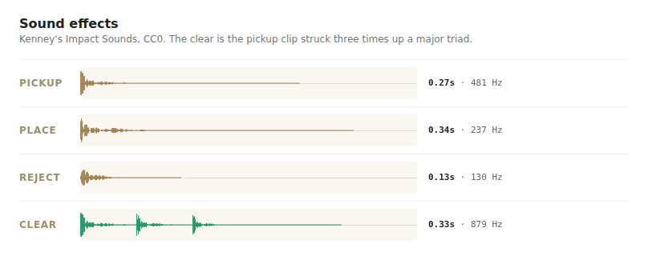

# Sound effects

Four sounds, wired up in `web/sfx.js`.

They play whether you or the assist is moving the pieces, but not at the assist's
Max speed, where moves land faster than the ear can separate them. That is the same
condition the fly animation uses — `assistShowsMoves()` in `web/script.js` — so a
move is sounded exactly when it is slow enough to be shown.

Sound is **off until someone turns it on**, with the button beside the assist
picker, and the choice is remembered in a cookie. While it is off, none of the
clips are downloaded at all.

| | clip | centroid | length |
|---|---|---|---|
| pickup | `impactWood_light_000` | 481 Hz | 0.26s |
| place | `impactWood_medium_000` | 237 Hz | 0.33s |
| reject | `impactSoft_medium_000` | 130 Hz | 0.12s |
| clear | `impactWood_light_000` ×3, pitched | 879 Hz | 0.34s |

Centroid is spectral centroid — roughly where a sound sits on a dull-to-bright
axis. It is worth checking against for anything new, because it is what ruled out
the first attempt at these: a set built from Kenney's UI packs, where `mouseclick1`
measured 9333 Hz against wood's 108–481 Hz and sounded like it.

## The clear

The clear is the pickup clip struck three times up a major triad — root, third,
fifth — 70 ms apart and tapering, using `playbackRate`. It is a small marimba
played on the same piece of wood as everything else, and it needs no file of its
own. The hits are spaced enough that the three sum to −1 dBFS rather than clip.

Every event is a list of hits for that reason, so any of the others could become a
run the same way.

## The reject

A dull thud rather than a buzz: an impact that doesn't ring, which reads as the
piece coming to rest without being played. Balance between the four events lives in
`EVENT_GAIN` in `web/sfx.js` rather than in the files.

It fires on every lift that doesn't become a move — refused by the board and taken
back to the hand alike. Those were split once, on the reasoning that a change of
mind is not a failure and shouldn't be buzzed at, but the thud is soft enough not
to read as a scolding, and the pickup has already sounded by then: leaving the
change of mind silent left that sound unanswered.

This is the one clip the levelling below doesn't leave on equal footing. It reached
−18 dB RMS before it reached −1 dB peak, so it sits 3.7 dB lower in peak than the
two wood clips; it is a third their length; and at 130 Hz it is where the ear is
least sensitive and where a phone speaker gives up. Measured K-weighted over a
400 ms window, it came out 4.7 dB under the place at the gains that were set — as
quiet as the pickup, which is deliberately under everything. `EVENT_GAIN.reject` is
1.0 to put it level with the place, and it can go to 1.7 before the clip peaks.

## Where these came from

All three clips are Kenney's, from the [Impact Sounds](https://kenney.nl/assets/impact-sounds)
pack — **CC0**: public domain, commercial use fine, no attribution required. The
credit here is for our own benefit, not the licence's.

The pack is mirrored file-by-file at
[gamesounds.xyz](https://gamesounds.xyz/?dir=Kenney%27s+Sound+Pack/Impact+Sounds),
which is easier than re-downloading a whole zip to try a different `impactWood`.

## What was done to them

Levelled: each file moved by the gentler of "bring RMS to −18 dB" and "bring peak
to −1 dB", so no clip has to be compensated for in code.

Transcoded to 16-bit mono WAV. Kenney ships `.ogg`, which Safari only learned to
play in 18.4. AAC was tried first and doesn't survive contact with open-source
Chromium builds, which have no AAC decoder and so play nothing at all. WAV is the
one format nothing has an opinion about, and it has no decoder delay to smear a
short attack. Three clips come to 68 KB, fetched when sound is switched on and
decoded on the gesture that switches it.

## Where each one fires

Playing by hand, from the drag handlers in `web/script.js`: the pickup when the
drag crosses its threshold rather than on mousedown, so a tap that is deliberately
nothing sounds like nothing; the reject on any drag that ends without a move, which
pairs it one-to-one with the pickup that started that drag.

Watching the assist, from the same move the fly animation is drawn from: the pickup
as the piece leaves the hand, the place as it arrives, and the clear when the board
actually updates and the cells shrink out — which at 1x is a beat later, because
that is when it happens on screen.
